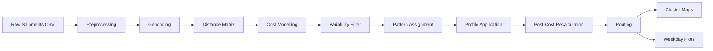

# Delivery Profiles

A production-grade Python pipeline that transforms raw shipment records into optimized delivery schedules — reducing freight cost volatility while preserving service quality.

Built across 10 modular stages: ingestion → geocoding → distance matrix → cost modelling → variability filtering → OR-Tools optimization → profile application → routing → maps → plots.

**Stack:** Python · pandas · OR-Tools · scikit-learn · OSRM · Folium · YAML config

**Key outputs:**
- Optimized weekday delivery profiles per recipient
- Before/after freight cost comparison (PDF)
- Interactive cluster maps (Folium HTML)
- Weekday demand and freight cost visualizations (PDF)



## High-Level Workflow

The pipeline runs the following stages:

### 1. Preprocessing
- Column normalization
- Address cleaning
- Date & numeric conversions
- Standardized schema output

### 2. Geocoding
- Uses a Nominatim-compatible endpoint
- Stores coordinates in a JSON cache
- Avoids repeated API calls

### 3. Distance Matrix

Two modes:
- **compute** → OSRM route matrix + Haversine (Euclidean) distances
- **load** → load precomputed CSV matrices

### 4. Cost Modeling

Adds freight cost via:
- Tariff matrix lookup
- Base + tonnage model

### 5. Variability Analysis

Filters recipients by:
- Minimum shipment frequency
- Weight variability threshold
- Frequency variability threshold

### 6. Pattern Assignment

- Non-clustered optimization (always runs)
- Optional clustered optimization (KMeans + shared patterns)
- Uses OR-Tools internally (knapsack-style demand smoothing)

### 7. Profile Application

Applies optimized weekday patterns. Produces:
- pattern-only shipments
- unchanged shipments
- combined shipment dataset

### 8. Post-Cost Recalculation (Optional)

Recomputes freight costs after profile application using the same tariff configuration. Enabled by default; disable with `post_cost_recalc.enabled: false`.

### 9. Routing (Optional)

Vehicle routing via OR-Tools VRP solver. Groups consolidated shipments by weekday and finds optimal delivery sequences. Outputs `routes.json` (and `routes_cluster.json` when clustering is enabled). Disabled by default; enable with `routing.enabled: true`.

### 10. Maps & Visualization (Optional)

- **Cluster map** — interactive Folium HTML showing recipient clusters and assigned patterns
- **Weekday plots PDF** — demand percentage and weight distribution before/after profiles
- **Freight cost comparison PDF** — bar chart of freight cost share per weekday across scenarios (two-way without clustering, three-way with)

---

## Repository Structure

```text
.
├── config/
│   └── default.yaml
├── scripts/
│   ├── run_pipeline.py
│   └── make_plots.py           # legacy standalone; plots now run automatically
├── src/delivery_profiles/
│   ├── __init__.py
│   ├── pipeline.py
│   ├── preprocessing.py
│   ├── geo.py
│   ├── distance_matrix.py
│   ├── cost_model.py
│   ├── variability.py
│   ├── knapsack.py
│   ├── pattern_assignment.py
│   ├── clustered_pattern_assignment.py
│   ├── profile_application.py
│   ├── routing_vrp.py
│   ├── maps.py
│   ├── weekday_plots.py
│   └── config.py
├── pyproject.toml
└── README.md
```

## Requirements

- Python 3.9+
- pip / venv

Core dependencies:

- pandas
- numpy
- scikit-learn
- ortools
- requests
- PyYAML
- matplotlib
- folium

Install manually:

```bash
pip install pandas numpy scikit-learn ortools requests pyyaml matplotlib folium
```

## Installation

```bash
python -m venv .venv
source .venv/bin/activate     # Windows: .venv\Scripts\activate
pip install --upgrade pip
pip install -e .
```

## Configuration

Main config file: `config/default.yaml`

Important sections:

### `paths`
Defines raw data, output, and cache locations.

### `run_naming`
Automatically creates run-specific output folders.
Example: `outputs/runs/minF2_varW0.75_varF0.75/`

### `preprocessing`
- `write_preprocessed_csv: false` — set to `true` to save the cleaned shipments CSV before geocoding

### `geocoding`
- `base_url` — Nominatim-compatible endpoint
- `rate_limit_seconds` — pause between API calls
- `timeout_seconds`
- `use_cache: true` — skips geocoding for recipients already in the JSON cache

### `distance_matrix`
- `mode: compute | load`
- OSRM settings (if compute): `base_url`, `chunk_size`, `rate_limit_seconds`, `timeout_seconds`, `symmetrize`
- CSV paths (if load): `shipments_with_distances`, `distances_rr`, `durations_rr`, `euclidean_rr`, `matrix_table`

### `cost_model`
- `tariff_type: matrix | base_plus_ton`

If `tariff_type = base_plus_ton`, freight cost is calculated as:
```
Freight Cost = base_price + (Weight in kg / 1000) × price_per_ton
```

### `variability`
- `min_frequency`
- `var_weight_max`
- `var_frequency_max`

### `pattern_assignment`
- `days` — number of working days per cycle
- `time_limit_seconds` — OR-Tools solver time limit
- `round_border` — rounding threshold for demand fractions

### `clustering`
- `enabled: true | false`
- `num_clusters` — number of KMeans clusters
- `random_state`

### `post_cost_recalc`
- `enabled: true` (default) — recomputes freight costs for consolidated shipments after profile application; set to `false` to skip

### `routing`
- `enabled: false` (default) — set to `true` to run VRP route optimization after profile application; requires a precomputed `durations_rr` matrix

### `maps`
- `enabled: true | false`
- `provider: osm | google_roadmap | google_satellite`
- `zoom_start`
- `anonymize` — omit recipient labels from the map

### `plots`
- `enabled: true` (default) — set to `false` to skip PDF generation (weekday plots and freight cost comparison)

---

## Running the Pipeline

From project root:

```bash
python scripts/run_pipeline.py \
  --config config/default.yaml \
  --shipments data/raw/shipments.csv \
  --tariff data/raw/tariff_matrix.csv \
  --sender-lon 7.4653 \
  --sender-lat 51.5136
```

### Required Arguments

- `--shipments`
- `--sender-lon`
- `--sender-lat`

Required if `tariff_type = matrix`:

- `--tariff`

---

## Output Structure

When `run_naming` is enabled:

```text
outputs/
└── runs/
    └── minF2_varW0.75_varF0.75/
        ├── shipments_with_coords.csv
        ├── shipments_with_distances.csv
        ├── shipments_with_costs.csv
        ├── weekly_frequency.csv
        ├── weekly_weight.csv
        ├── variability.csv
        ├── variability_eu.csv
        ├── profile_assignment.csv
        ├── profile_assignment_clustered.csv   # clustering.enabled=true only
        ├── coords_clustered.csv               # clustering.enabled=true only
        ├── shipments_after_profiles_*.csv
        ├── routes.json                        # routing.enabled=true only
        ├── routes_cluster.json                # routing.enabled=true + clustering only
        ├── matrices/
        │   ├── distances_rr.csv
        │   ├── durations_rr.csv
        │   ├── euclidean_rr.csv
        │   ├── matrix_table.csv
        │   ├── distances_sender.csv
        │   ├── durations_sender.csv
        │   └── euclidean_sender.csv
        ├── plots/
        │   ├── weekday_plots_*.pdf
        │   └── freight_cost_comparison.pdf
        └── maps/
            └── cluster_map_*.html
```

Each threshold configuration produces a separate run folder. No outputs are overwritten.

---

## Maps

Cluster maps are generated as:

`outputs/runs/<run_id>/maps/cluster_map_*.html`

They are interactive Folium maps. Supports:

- OpenStreetMap (`osm`)
- Google roadmap (`google_roadmap`)
- Google satellite (`google_satellite`)

---

## GitHub Note

The repository intentionally does not include data or output folders.

## License

No license.
