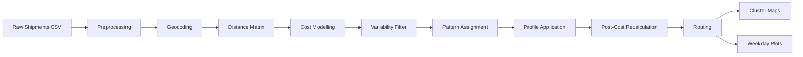

# Delivery Profiles

A production-grade Python pipeline that transforms raw shipment records into optimized delivery schedules — reducing freight cost volatility while preserving service quality.

Built across 10 modular stages: ingestion → geocoding → distance matrix → cost modelling → variability filtering → OR-Tools optimization → profile application → routing → maps → plots.

**Stack:** Python · pandas · OR-Tools · scikit-learn · OSRM · Folium · YAML config

**Key outputs:**
- Optimized weekday delivery profiles per recipient
- Before/after freight cost comparison (PDF)
- Interactive cluster maps (Folium HTML)
- Weekday demand and freight cost visualizations (PDF)



## High-Level Workflow

The pipeline runs the following stages:

### 1. Preprocessing
- Column normalization
- Address cleaning
- Date & numeric conversions
- Standardized schema output

### 2. Geocoding
- Uses a Nominatim-compatible endpoint
- Stores coordinates in a JSON cache
- Avoids repeated API calls

### 3. Distance Matrix

Two modes:
- **compute** → OSRM route matrix + Haversine (Euclidean) distances
- **load** → load precomputed CSV matrices

### 4. Cost Modeling

Adds freight cost via:
- Tariff matrix lookup
- Base + tonnage model

### 5. Variability Analysis

Filters recipients by:
- Minimum shipment frequency
- Weight variability threshold
- Frequency variability threshold

### 6. Pattern Assignment

- Non-clustered optimization (always runs)
- Optional clustered optimization (KMeans + shared patterns)
- Uses OR-Tools internally (knapsack-style demand smoothing)

### 7. Profile Application

Applies optimized weekday patterns. Produces:
- pattern-only shipments
- unchanged shipments
- combined shipment dataset

### 8. Post-Cost Recalculation (Optional)

Recomputes freight costs after profile application using the same tariff configuration. Enabled by default; disable with `post_cost_recalc.enabled: false`.

### 9. Routing (Optional)

Vehicle routing via OR-Tools VRP solver. Groups consolidated shipments by weekday and finds optimal delivery sequences. Outputs `routes.json` (and `routes_cluster.json` when clustering is enabled). Disabled by default; enable with `routing.enabled: true`.

### 10. Maps & Visualization (Optional)

- **Cluster map** — interactive Folium HTML showing recipient clusters and assigned patterns
- **Weekday plots PDF** — demand percentage and weight distribution before/after profiles
- **Freight cost comparison PDF** — bar chart of freight cost share per weekday across scenarios (two-way without clustering, three-way with)

---

## Algorithms & Optimization

### MIP Pattern Assignment

Each eligible recipient is assigned one delivery pattern from a fixed library of 21 binary Mon–Fri patterns, grouped by weekly frequency:

| Frequency | Patterns | Example |
|-----------|----------|---------|
| 5/week | 1 | `[1,1,1,1,1]` (every day) |
| 4/week | 5 | `[0,1,1,1,1]` … `[1,1,1,1,0]` (skip one day) |
| 3/week | 5 | `[0,1,0,1,1]` … `[1,0,1,1,0]` |
| 2/week | 5 | `[1,0,1,0,0]` … `[0,1,0,0,1]` |
| 1/week | 5 | `[1,0,0,0,0]` … `[0,0,0,0,1]` (one fixed day) |

The assignment is formulated as a Mixed Integer Program (MIP) solved with OR-Tools SCIP via `pywraplp`:

- **Decision variables:** `x[j,m] ∈ {0,1}` — recipient `j` uses pattern `m`
- **Objective:** minimise `s`, the peak daily shipped quantity across all five weekdays
- **Constraints:**
  - For each weekday `t`: the sum of demands from all recipients scheduled on day `t` must not exceed `s`
  - Each recipient selects exactly one pattern

Each recipient's **demand** is `round(avg_weight / avg_frequency)` and their **frequency** is `round_custom(AVG_Frequency, round_border)` clipped to [1, 5]. Before the solver runs, recipients are filtered to those whose weight CV ≤ `var_weight_max`, frequency CV ≤ `var_frequency_max`, and average shipments/week ≥ `min_frequency`.

The effect is that the solver smooths total daily shipped quantity as evenly as possible across the working week, without prescribing which specific day any recipient receives.

---

### KMeans Clustering (Clustered Assignment)

When `clustering.enabled: true`, recipients are grouped into geographic clusters before pattern assignment runs. Coordinates are converted to **radians** before passing to `sklearn.KMeans`, which makes the Euclidean distance in radian-space a closer proxy for great-circle distance than raw degree differences.

The MIP is then extended with an additional constraint: all recipients in the same `(cluster, frequency)` group must share the same pattern. This is enforced via auxiliary binary variables `y[group, m]` with `x[j,m] == y[group,m]` for every member `j` of the group. The result is that geographically adjacent recipients with the same delivery frequency receive on the same days — reducing the number of distinct routes the depot needs to operate.

---

### Haversine Distance

Two types of distance are computed for every recipient:

1. **Euc_Distance** (sender → recipient, km) — attached to every shipment row and used as the distance input for tariff lookups
2. **Recipient-to-recipient matrix** — full N×N matrix used by the VRP routing solver

Both are computed with the Haversine formula (great-circle distance), implemented without an external library using NumPy broadcasting:

```
a = sin²(Δlat/2) + cos(lat₁)·cos(lat₂)·sin²(Δlon/2)
d = 2·R·arcsin(√a),   R = 6371.0088 km
```

The vectorised `haversine_matrix_km` function computes the full N×N matrix in a single pass using NumPy broadcasting, avoiding a Python loop over pairs. When `distance_matrix.mode: compute` is used, OSRM road distances and durations are computed separately (chunked requests of up to 100 locations each) for routing and for the matrix table. The Haversine `Euc_Distance` is always computed regardless of mode.

---

### OR-Tools VRP Routing

The routing step (`routing.enabled: true`) solves one independent Vehicle Routing Problem per weekday using OR-Tools `pywrapcp` (Constraint Solver, distinct from the MIP solver used above):

- **Vehicles:** 5, all departing from and returning to the depot (node 0)
- **Cost metric:** travel duration in seconds (from the precomputed OSRM `durations_rr` matrix)
- **Duration constraint:** each vehicle's total route time must not exceed **8 hours (28 800 seconds)**
- **First solution strategy:** `PATH_CHEAPEST_ARC` — greedily extends each partial route by the cheapest available arc
- **Depot row/column:** sender-to-recipient durations from `df_added_freightcost["Duration"]` are inserted as row 0 and column 0 of the duration matrix so the depot is correctly represented as the origin and destination

Each weekday is solved independently: the solver receives only the recipients whose consolidated profile includes that day, and produces a set of vehicle routes that cover all of them within the 8-hour limit. Solutions are appended to `routes.json` (one entry per weekday).

---

## Repository Structure

```text
.
├── config/
│   └── default.yaml
├── scripts/
│   ├── run_pipeline.py
│   └── make_plots.py           # legacy standalone; plots now run automatically
├── src/delivery_profiles/
│   ├── __init__.py
│   ├── pipeline.py
│   ├── preprocessing.py
│   ├── geo.py
│   ├── distance_matrix.py
│   ├── cost_model.py
│   ├── variability.py
│   ├── knapsack.py
│   ├── pattern_assignment.py
│   ├── clustered_pattern_assignment.py
│   ├── profile_application.py
│   ├── routing_vrp.py
│   ├── maps.py
│   ├── weekday_plots.py
│   └── config.py
├── pyproject.toml
└── README.md
```

## Requirements

- Python 3.9+
- pip / venv

Core dependencies:

- pandas
- numpy
- scikit-learn
- ortools
- requests
- PyYAML
- matplotlib
- folium

Install manually:

```bash
pip install pandas numpy scikit-learn ortools requests pyyaml matplotlib folium
```

## Installation

```bash
python -m venv .venv
source .venv/bin/activate     # Windows: .venv\Scripts\activate
pip install --upgrade pip
pip install -e .
```

## Configuration

Main config file: `config/default.yaml`

Important sections:

### `paths`
Defines raw data, output, and cache locations.

### `run_naming`
Automatically creates run-specific output folders.
Example: `outputs/runs/minF2_varW0.75_varF0.75/`

### `sender`
- `lon` — sender/depot longitude (default: `9.3372`)
- `lat` — sender/depot latitude (default: `53.124339`)

Can be overridden per run with `--sender-lon` / `--sender-lat` on the CLI.

### `preprocessing`
- `write_preprocessed_csv: false` — set to `true` to save the cleaned shipments CSV before geocoding

### `geocoding`
- `base_url` — Nominatim-compatible endpoint
- `rate_limit_seconds` — pause between API calls
- `timeout_seconds`
- `use_cache: true` — skips geocoding for recipients already in the JSON cache

### `distance_matrix`
- `mode: compute | load`
- OSRM settings (if compute): `base_url`, `chunk_size`, `rate_limit_seconds`, `timeout_seconds`, `symmetrize`
- CSV paths (if load): `shipments_with_distances`, `distances_rr`, `durations_rr`, `euclidean_rr`, `matrix_table`

### `cost_model`
- `tariff_type: matrix | base_plus_ton`

If `tariff_type = base_plus_ton`, freight cost is calculated as:
```
Freight Cost = base_price + (Weight in kg / 1000) × price_per_ton
```

### `variability`
- `min_frequency`
- `var_weight_max`
- `var_frequency_max`

### `pattern_assignment`
- `days` — number of working days per cycle
- `time_limit_seconds` — OR-Tools solver time limit
- `round_border` — rounding threshold for demand fractions

### `clustering`
- `enabled: true | false`
- `num_clusters` — number of KMeans clusters
- `random_state`

### `post_cost_recalc`
- `enabled: true` (default) — recomputes freight costs for consolidated shipments after profile application; set to `false` to skip

### `routing`
- `enabled: false` (default) — set to `true` to run VRP route optimization after profile application; requires a precomputed `durations_rr` matrix

### `maps`
- `enabled: true | false`
- `provider: osm | google_roadmap | google_satellite`
- `zoom_start`
- `anonymize` — omit recipient labels from the map

### `plots`
- `enabled: true` (default) — set to `false` to skip PDF generation (weekday plots and freight cost comparison)

---

## Running the Pipeline

From project root:

```bash
python scripts/run_pipeline.py \
  --config config/default.yaml \
  --shipments data/raw/shipments.csv \
  --tariff data/raw/tariff_matrix.csv
```

Override the sender location from the command line if needed:

```bash
python scripts/run_pipeline.py \
  --config config/default.yaml \
  --shipments data/raw/shipments.csv \
  --tariff data/raw/tariff_matrix.csv \
  --sender-lon 7.4653 \
  --sender-lat 51.5136
```

### Required Arguments

- `--shipments`

Required if `tariff_type = matrix`:

- `--tariff`

### Optional Arguments

- `--sender-lon` — overrides `sender.lon` in config
- `--sender-lat` — overrides `sender.lat` in config

Sender coordinates must be set in at least one place (config or CLI). The pipeline raises an error at startup if neither is provided.

---

## Output Structure

When `run_naming` is enabled:

```text
outputs/
└── runs/
    └── minF2_varW0.75_varF0.75/
        ├── shipments_with_coords.csv
        ├── shipments_with_distances.csv
        ├── shipments_with_costs.csv
        ├── weekly_frequency.csv
        ├── weekly_weight.csv
        ├── variability.csv
        ├── variability_eu.csv
        ├── profile_assignment.csv
        ├── profile_assignment_clustered.csv   # clustering.enabled=true only
        ├── coords_clustered.csv               # clustering.enabled=true only
        ├── shipments_after_profiles_*.csv
        ├── routes.json                        # routing.enabled=true only
        ├── routes_cluster.json                # routing.enabled=true + clustering only
        ├── matrices/
        │   ├── distances_rr.csv
        │   ├── durations_rr.csv
        │   ├── euclidean_rr.csv
        │   ├── matrix_table.csv
        │   ├── distances_sender.csv
        │   ├── durations_sender.csv
        │   └── euclidean_sender.csv
        ├── plots/
        │   ├── weekday_plots_*.pdf
        │   └── freight_cost_comparison.pdf
        └── maps/
            └── cluster_map_*.html
```

Each threshold configuration produces a separate run folder. No outputs are overwritten.

---

## Maps

Cluster maps are generated as:

`outputs/runs/<run_id>/maps/cluster_map_*.html`

They are interactive Folium maps. Supports:

- OpenStreetMap (`osm`)
- Google roadmap (`google_roadmap`)
- Google satellite (`google_satellite`)

---

## GitHub Note

The repository intentionally does not include data or output folders.

## License

No license.
